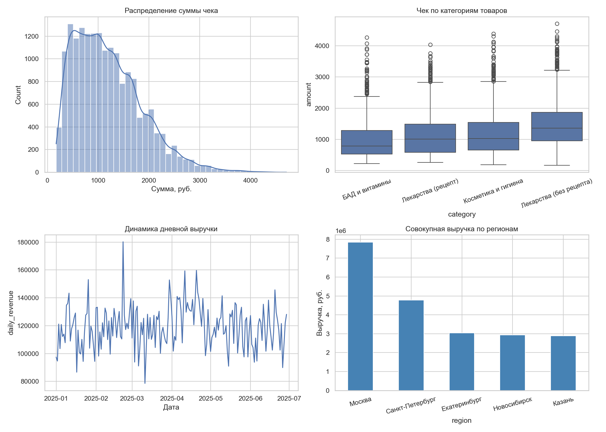
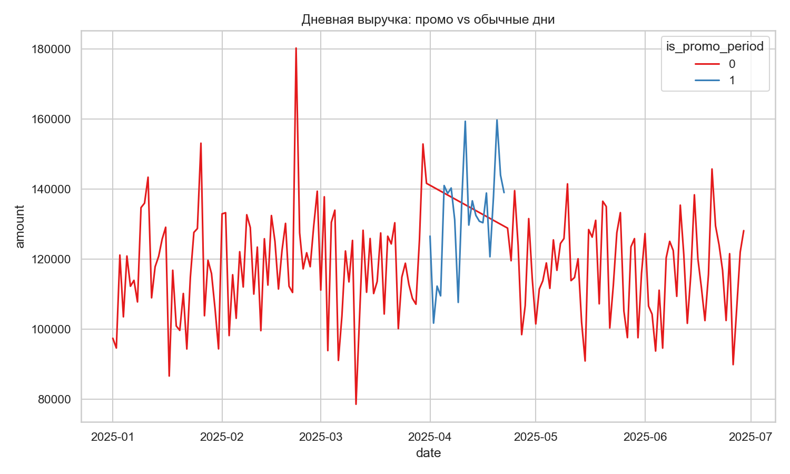
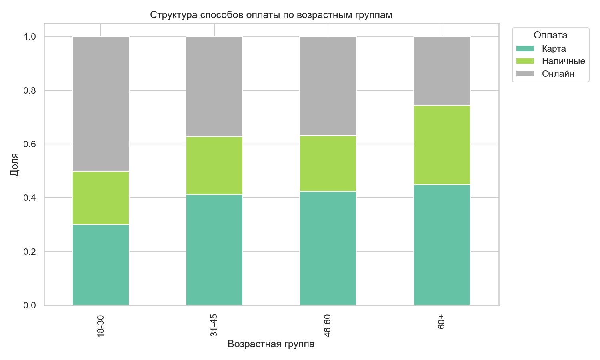
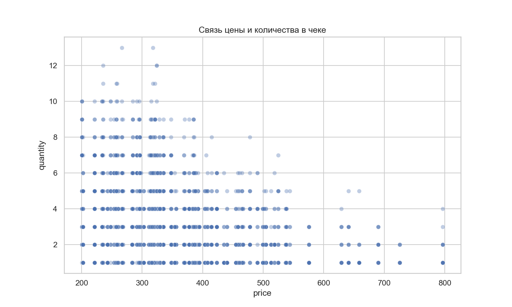

# Итоговый проект по статистике  
## Статистический анализ продаж аптечной сети «ФармаПлюс»

**Автор:** Максим Антоненко 
**Инструменты:** Python 3.13, pandas, scipy, statsmodels, matplotlib, seaborn

---

## 1. Описание задачи и бизнес-контекст

### Бизнес
«ФармаПлюс» — региональная аптечная сеть из 22 точек в 5 городах России (Москва, Санкт-Петербург, Казань, Новосибирск, Екатеринбург). Сеть продаёт рецептурные и безрецептурные лекарства, косметику и гигиену, БАД и витамины.

### Разрез анализа
Анализ проводится с точки зрения **оптимизации выручки и клиентского опыта**:
- сегментация покупателей (пол, возраст, способ оплаты);
- эффективность промо-кампаний;
- структура продаж по категориям товаров;
- региональные различия в цифровом поведении.

### Для кого полезны выводы
| Аудитория | Применение |
|-----------|------------|
| Коммерческий директор | Планирование промо, ассортимент по категориям |
| Маркетинг | Таргетинг по полу и возрасту, digital-стратегия |
| Операционный блок | Нагрузка на аптеки в выходные, логистика |
| IT / продукт | Развитие онлайн-оплаты и мобильного приложения |

### Источник данных
Синтетический датасет, сгенерированный скриптом `generate_data.py` (17 950 транзакций за 180 дней, 93 SKU). Генерация выбрана осознанно: воспроизводимый пайплайн, прозрачные закономерности, возможность приложить код в портфолио.

**Файлы данных:**
- `data/transactions.csv` — транзакции
- `data/products.csv` — каталог товаров
- `data/daily_revenue.csv` — агрегированная дневная выручка

---

## 2. Подготовка данных

### Что сделано
1. Сгенерированы три связанных таблицы с фиксированным `seed=42` для воспроизводимости.
2. Проверены типы полей: даты, числовые показатели, категориальные признаки.
3. Пропусков и дубликатов `transaction_id` нет.
4. Добавлены производные признаки: день недели, месяц, флаг выходного.

### Зачем это нужно
Без чистой и структурированной базы нельзя корректно применять критерии: t-тесты требуют независимых наблюдений, χ² — достаточных частот в ячейках, ANOVA — корректной группировки.

**Код подготовки:** см. `generate_data.py` и блок загрузки в `statistical_analysis.py`.

---

## 3. Базовый анализ характеристик

### 3.1. Описательная статистика (транзакционный уровень)

| Показатель | Значение | Интерпретация |
|------------|----------|---------------|
| Число транзакций | 17 950 | Объём выборки достаточен для параметрических тестов |
| Средний чек | 1 197 руб. | Типичная покупка в аптечном сегменте среднего ценового уровня |
| Медианный чек | 1 084 руб. | Медиана ниже среднего → правый хвост (крупные чеки) |
| Среднее кол-во единиц в чеке | 3,53 | Покупатели берут несколько позиций за визит |
| Средняя дневная выручка сети | 119 365 руб. | Базовый ориентир для планирования |
| Станд. откл. дневной выручки | 15 353 руб. | Умеренная волатильность |
| Коэфф. вариации (CV) | 12,9% | Относительная стабильность дневной выручки |

**Почему считаем именно эти метрики:**
- *Среднее и медиана* — оценка «типичного» чека; расхождение указывает на асимметрию.
- *CV дневной выручки* — сравнимая мера риска/стабильности во времени.
- *Количество единиц* — прокси глубины корзины (cross-sell).

### 3.2. Визуальный обзор



**Что видно на графиках:**
1. Распределение чека правоскошенное — есть крупные покупки (наборы БАД, косметика).
2. Категории различаются по уровню чека (подтверждается ANOVA в разделе 4).
3. Выручка по дням колеблется вокруг тренда; заметен всплеск в промо-период.
4. Москва даёт наибольшую совокупную выручку за счёт числа точек и трафика.

### 3.3. Сегментные срезы

**Средний чек по полу:**
| Пол | Средний чек | Медиана | N |
|-----|-------------|---------|---|
| Женский | 1 239 руб. | 1 125 руб. | 10 392 |
| Мужской | 1 139 руб. | 1 026 руб. | 7 558 |

**Средний чек по категориям:**
| Категория | Средний чек | N |
|-----------|-------------|---|
| Лекарства (без рецепта) | 1 434 руб. | 6 027 |
| Косметика и гигиена | 1 138 руб. | 5 494 |
| Лекарства (рецепт) | 1 095 руб. | 3 221 |
| БАД и витамины | 955 руб. | 3 208 |

---

## 4. Статистические гипотезы: формулировка, проверка, выводы

Уровень значимости везде: **α = 0,05**.

### H1. Средний чек женщин выше, чем у мужчин

| | |
|---|---|
| **Тип данных** | Количественные, две независимые группы |
| **Обоснование гипотезы** | В аптечном ритейле женщины чаще совершают плановые закупки семейного ассортимента (косметика, витамины, детские товары), что может увеличивать чек |
| **H₀** | μ_жен = μ_муж |
| **H₁** | μ_жен > μ_муж |
| **Критерий** | Односторонний t-критерий Стьюдента |
| **Проверка дисперсий** | Levene: p < 0,001 → использован t-критерий с `equal_var=False` (Уэлча) |
| **Результат** | t = 10,15, **p < 0,001** → **H₀ отвергается** |
| **Вывод** | Разница ~100 руб. статистически значима. Для маркетинга: женская аудитория — приоритетный сегмент для программ лояльности и апсейла |
| **Почему так может быть** | Более широкая корзина (смешанные категории), регулярные закупки для семьи |

---

### H2. Средняя дневная выручка в промо-период выше обычной

| | |
|---|---|
| **Тип данных** | Количественные, парные наблюдения (дни) |
| **Обоснование** | Скидки должны стимулировать трафик; важно понять, растёт ли именно дневная выручка, а не только число чеков |
| **H₀** | μ_промо = μ_обыч |
| **H₁** | μ_промо > μ_обыч |
| **Критерий** | Парный t-критерий (22 пары сопоставимых дней) |
| **Результат** | t = 4,52, **p = 0,000093** → **H₀ отвергается** |
| **Эффект** | Средняя дневная выручка: промо — 132 032 руб., обычные дни — 117 601 руб. (+12,3%) |
| **Вывод** | Промо-кампания эффективна на уровне сети. При этом средний чек в промо чуть ниже (1 143 vs 1 206 руб.) — рост идёт за счёт объёма трафика, а не размера покупки |
| **Рекомендация** | Сохранять промо, но тестировать механики, повышающие глубину корзины (наборы, «2+1») |



---

### H3. Средний чек различается между категориями товаров

| | |
|---|---|
| **Тип данных** | Количественные, 4 группы |
| **Обоснование** | Ассортиментная политика требует понимания, какие категории формируют высокий средний чек |
| **H₀** | μ₁ = μ₂ = μ₃ = μ₄ |
| **H₁** | Хотя бы одно среднее отличается |
| **Критерий** | Однофакторный ANOVA |
| **Результат** | F = 469,51, **p < 0,001** → **H₀ отвергается** |
| **Вывод** | Лидер — безрецептурные лекарства (1 434 руб.), наименьший чек — БАД (955 руб.). Категории нельзя управлять единой ценовой политикой |
| **Почему** | Разная ценовая структура SKU, разная кратность покупки (лекарства — курсами, БАД — импульсно) |

---

### H4. Способ оплаты зависит от возрастной группы

| | |
|---|---|
| **Тип данных** | Две категориальные переменные |
| **Обоснование** | Digital-трансформация сети: нужно понять, как возраст влияет на выбор онлайн-оплаты |
| **H₀** | Способ оплаты и возраст независимы |
| **H₁** | Существует связь |
| **Критерий** | χ² Пирсона, df = 6 |
| **Результат** | χ² = 526,71, **p < 0,001** → **H₀ отвергается** |
| **Вывод** | Молодые группы (18–30) чаще платят онлайн; группа 60+ — преимущественно наличные. Это не случайность, а устойчивый паттерн поведения |
| **Почему** | Цифровая грамотность, привычка к маркетплейсам у молодых; барьер доверия и привычка у старших |



---

### H5. Цена товара отрицательно связана с количеством в чеке

| | |
|---|---|
| **Тип данных** | Две количественные переменные |
| **Обоснование** | Проверка закона спроса: дорогие позиции могут покупаться реже/в меньшем объёме |
| **H₀** | ρ = 0 |
| **H₁** | ρ < 0 |
| **Критерий** | Корреляция Пирсона |
| **Результат** | r = **−0,39**, **p < 0,001** → **H₀ отвергается** |
| **Вывод** | Умеренная отрицательная связь: при росте цены количество в чеке снижается. Для ценообразования — осторожность с повышением цен на чувствительные SKU |
| **Почему** | Бюджетное ограничение покупателя, возможность замены на аналог |



---

### H6. Доля онлайн-оплаты в Москве выше, чем в других регионах

| | |
|---|---|
| **Тип данных** | Бинарный признак (онлайн / не онлайн), сравнение долей |
| **Обоснование** | Москва — более цифровизированный рынок; сеть может тестировать digital-инициативы сначала там |
| **H₀** | p_Москва = p_регионы |
| **H₁** | p_Москва > p_регионы |
| **Критерий** | z-критерий для двух пропорций |
| **Результат** | z = 24,58, **p < 0,001** → **H₀ отвергается** |
| **Эффект** | Москва: **49,3%** онлайн; остальные регионы: **30,8%** |
| **Вывод** | Региональная digital-стратегия должна быть дифференцированной: в Москве — развитие omnichannel, в регионах — обучение и стимулы для первого онлайн-платежа |
| **Почему** | Плотность digital-инфраструктуры, привычка к доставке, конкуренция e-apteki |

---

### H7. Дневная выручка в выходные выше, чем в будни

| | |
|---|---|
| **Тип данных** | Количественные, независимые группы (непараметрический случай) |
| **Обоснование** | Планирование персонала и логистики; в выходные люди чаще посещают торговые точки |
| **H₀** | Распределения дневной выручки в будни и выходные одинаковы |
| **H₁** | Выручка в выходные стохастически больше |
| **Критерий** | Критерий Манна-Уитни (односторонний) |
| **Почему не t-тест** | Для надёжности при работе с агрегатами; H8 показала приемлемую нормальность, но Mann-Whitney — дополнительная проверка |
| **Результат** | U = 4 683, **p = 0,00001** → **H₀ отвергается** |
| **Эффект** | Средняя дневная выручка: выходные — 127 263 руб., будни — 116 156 руб. (+9,6%) |
| **Вывод** | Усилить смены и запас ходовых SKU в пт–вс; переносить промо-активации на выходные окна |

---

### H8. Дневная выручка распределена нормально (диагностическая)

| | |
|---|---|
| **Тип данных** | Проверка формы распределения |
| **Обоснование** | Обосновать применение параметрических критериев к дневной выручке |
| **H₀** | Данные из нормального распределения |
| **H₁** | Распределение не нормальное |
| **Критерий** | Шапиро-Уилка |
| **Результат** | W = 0,987, **p = 0,103** → **H₀ не отвергается** |
| **Вывод** | Дневная выручка сети приближённо нормальна (центральная предельная теорема при суммировании множества чеков). Параметрические тесты для дневных агрегатов уместны |

---

## 5. Сводная таблица проверки гипотез

| № | Гипотеза | Критерий | p-value | Решение |
|---|----------|----------|---------|---------|
| H1 | Чек женщин > мужчин | t-критерий (Уэлча) | < 0,001 | Отвергаем H₀ |
| H2 | Выручка в промо выше | Парный t-критерий | 0,000093 | Отвергаем H₀ |
| H3 | Чек различается по категориям | ANOVA | < 0,001 | Отвергаем H₀ |
| H4 | Оплата зависит от возраста | χ² | < 0,001 | Отвергаем H₀ |
| H5 | Цена ↓ количество | Пирсон | < 0,001 | Отвергаем H₀ |
| H6 | Онлайн в Москве чаще | z-тест пропорций | < 0,001 | Отвергаем H₀ |
| H7 | Выручка в выходные выше | Манна-Уитни | 0,00001 | Отвергаем H₀ |
| H8 | Нормальность дневной выручки | Шапиро-Уилка | 0,103 | Не отвергаем H₀ |

Полная таблица: `output/hypothesis_tests.csv`

---

## 6. Итоговые выводы и рекомендации

### Ключевые инсайты
1. **Сегментация покупателей статистически обоснована.** Женщины и разные возрастные группы ведут себя по-разному — единая коммуникация неэффективна.
2. **Промо работает**, но рост выручки идёт через трафик, а не через увеличение чека. Есть потенциал для комбинированных акций.
3. **Категории товаров — разные экономические единицы.** Безрецептурные лекарства тянут средний чек, БАД — объём и частоту.
4. **Цифровизация неоднородна:** Москва vs регионы, молодые vs старшие. Нужен поэтапный rollout digital-сервисов.
5. **Операционное планирование:** выходные — пиковая нагрузка (+9,6% к дневной выручке).

### Рекомендации для руководства «ФармаПлюс»

| Приоритет | Действие | Ожидаемый эффект |
|-----------|----------|------------------|
| 🔴 Высокий | Программа лояльности для женской аудитории 25–45 с кросс-категорийными офферами | Рост LTV и среднего чека |
| 🔴 Высокий | Усиление смен и запасов в выходные | Снижение out-of-stock, рост конверсии |
| 🟡 Средний | Промо 2.0: скидка + обязательный бандл (например, витамины + косметика) | Рост чека в промо-период |
| 🟡 Средний | Пилот онлайн-оплаты в Москве → масштабирование с обучением в регионах | +5–10 п.п. доли digital |
| 🟢 Низкий | Дифференцированное ценообразование в БАД (импульсные наборы по низкой цене) | Рост оборота без каннибализации |

---

## 7. Программный код

Весь воспроизводимый код находится в репозитории:

```
finall_project_stats/
├── generate_data.py          # генерация данных
├── statistical_analysis.py   # анализ и гипотезы
├── data/                     # CSV-файлы
├── output/                   # графики и таблицы результатов
├── requirements.txt
└── ОТЧЕТ_финальный_проект.md
```

### Порядок запуска

```bash
pip install -r requirements.txt
python generate_data.py
python statistical_analysis.py
```

---

## 8. Ограничения и дальнейшие шаги

1. **Синтетические данные** — выводы демонстрируют методологию; для реального бизнеса нужна валидация на фактических продажах.
2. **Нет учёта сезонности гриппа / рецептурных ограничений** — можно расширить модель генерации.
3. **Post-hoc тесты** (Tukey HSD после ANOVA) — рекомендуется добавить при работе с реальными данными для попарного сравнения категорий.
4. **Мультифакторный анализ** (регрессия выручки на промо + выходной + регион) — логичное продолжение проекта.

---

*Документ подготовлен для сдачи итогового проекта по статистике. Все расчёты воспроизводимы.*
